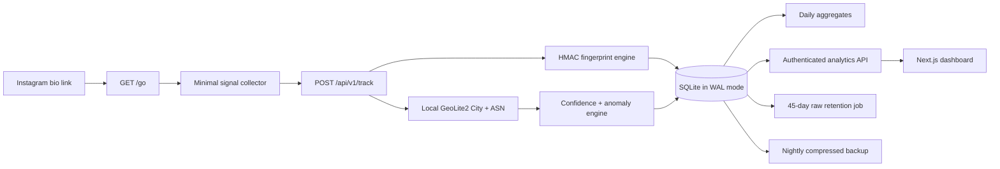

# Architecture

## System diagram

Nginx is the only internet-facing process. The FastAPI and Next.js containers
are reachable only on the Compose network. The public `/go` interstitial
collects timezone, language, platform, and screen size, posts them to the
tracker, then redirects to `REDIRECT_TARGET_URL`. With JavaScript disabled, a
fallback endpoint records only HTTP header signals and still redirects.

## Design decisions

- SQLite WAL mode is appropriate for the expected low write concurrency and
  keeps deployment and recovery simple.
- GeoIP runs locally. Visitor IP addresses are used only for the in-request
  lookup and transient rate-limit key, and are never persisted.
- Fingerprints are HMAC-SHA256 values derived only from allowed browser
  signals. They are approximate browser signatures, not proof of identity.
- Daily aggregates are updated in the same transaction as each event. Raw
  events can therefore expire without erasing long-term counts.
- A helper table records distinct visitor/location/day membership so unique
  daily counts remain exact without storing identity data.
- Network labels and confidence are heuristics. They are always displayed as
  estimates and must not be used for consequential decisions.

## Failure behavior

Missing GeoLite2 databases produce unknown locations with zero confidence.
Malformed browser signals are rejected without crashing the process. The
fallback redirect catches tracking failures so visitors still reach the
configured destination. Database failures return a generic 503 and are logged
without exposing internal details.

