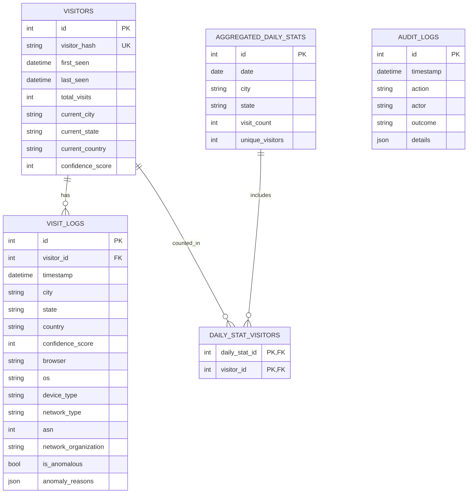

# Database schema

Alembic owns schema changes. The backend runs `alembic upgrade head` before
starting. Important query paths are indexed by visitor hash, visitor last-seen,
event timestamp, visitor/timestamp, aggregate date, and audit timestamp.

